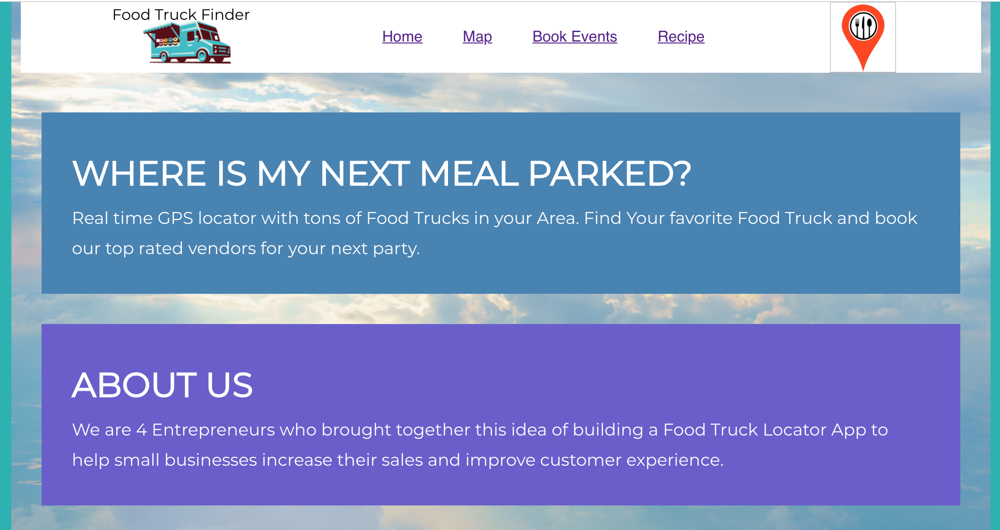
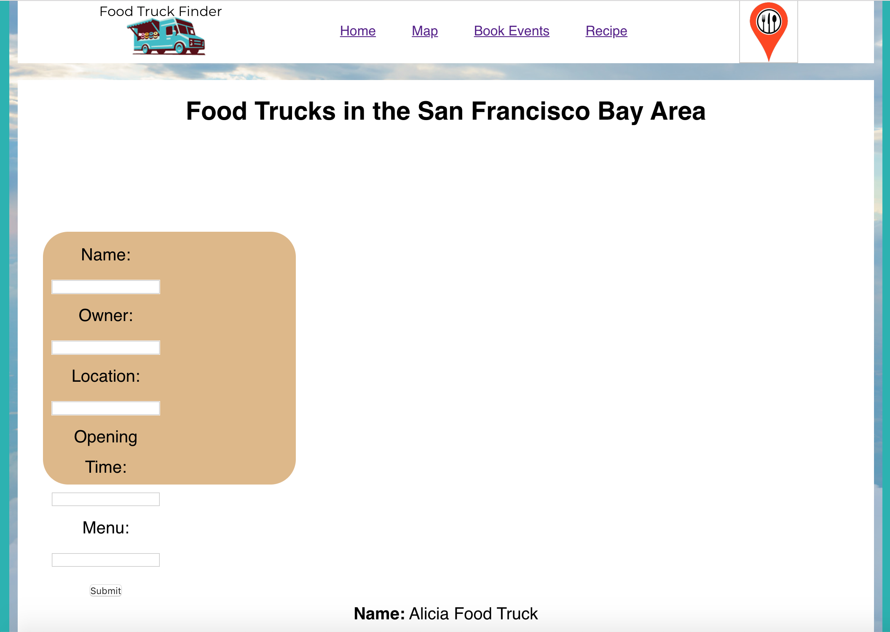
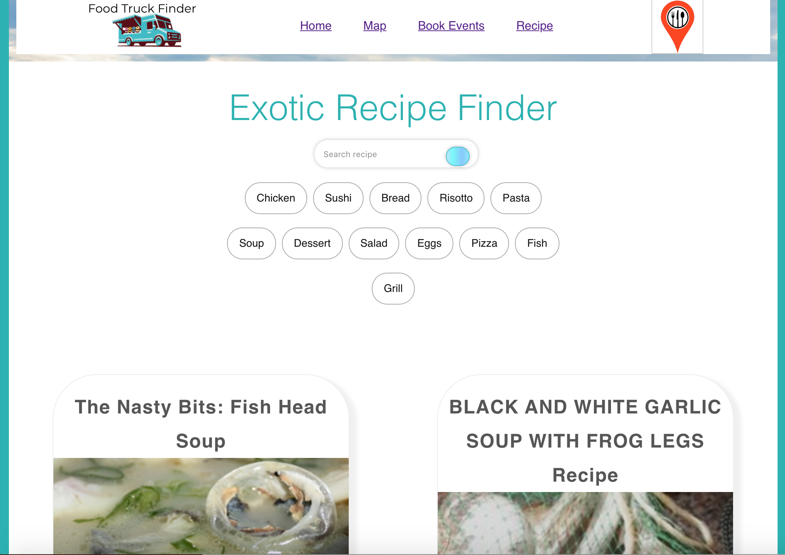
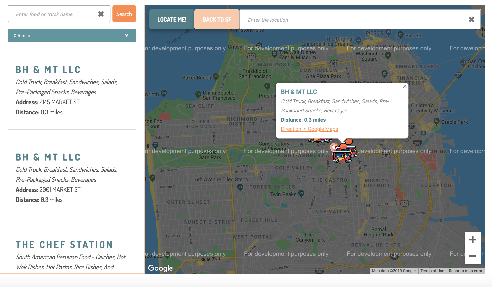

FIND MY FOOD TRUCK
==================

## Description

This App allows users to find Food Trucks in the San Francisco Area, It provides information about food trucks location and their current address, recipes and vendor registration(Book events). The App uses Node JS/React Router Dom, Redux, and Axios for the server and routing, MongoDB/Mongoose for the database and local input data for the layout and views,

## Dependencies

You will need to npm install the following node modules:
1. axios = npm axios => Install **[axios package](https://www.npmjs.com/package/axios)**
2. autosuggest-highlight = npm autosuggest-highlight => **[autosuggest-highlight](https://www.npmjs.com/package/autosuggest-highlight)**
3. mongoose = npm mongoose => **[mongoose package](https://www.npmjs.com/package/mongoose)**
4. react-autosuggest = npm react-autosuggest => **[react-autosuggest package](https://www.npmjs.com/package/react-autosuggest)**
5. react-google-maps = npm react-google-maps => **[react-google-maps package](https://www.npmjs.com/package/react-google-maps)**
6. react-router-dom = npm react-router-dom => **[react-router-dom package](https://www.npmjs.com/package/react-router-dom)**

7. react-redux = npm react-redux => **[redux package](https://www.npmjs.com/package/redux)**

Since I have included a package.json file, you do not need to install dependencies by name. Simply run the following in the root of your directory:

> npm i axios autosuggest-highlight autosuggest-highlight mongoose react-autosuggest react-google-maps react-router-dom 

## Getting Started

These instructions will get you a copy of the project up and running on your local machine for development. I will assume that you already have **[Node.js](https://nodejs.org/en/)** and **[MongoDB](https://www.mongodb.com/)** installed locally. See deployment for notes on how to deploy the project on a live system.

* Install dependencies
* In your CLI, enter mongodb or mongo
* In a new CLI Mac, go to the root directory and enter node.js
* in browser
* export PORT=3000
* The app will now be running locally on ***PORT=3000***
* you can access it localy from your browser at your localhost:3000.
* cd Desktop
* cd find-my-food-truck
* code .
* npm start

# Deployment

1. Follow these instructions to deploy your app live on Heroku

2. Create a heroku app "name" in heroku website
3.  Follow the deployment options in your "terminal" to deploy to heroku:
>- heroku login
>- heroku git:remote -a <app name>
>- git add .
>- git commit -m "heroku deploy"
>- git push heroku master

# ScreenShot

>Home Page Food Truck Animation - "Animation"

>Home Page - "Front - Main Page"

>Book Events - "Vendor Registration"

>Recipes - "Exotics Recipe Finder"

>Map - "Food Trucks Locator"

# Built With

- Visual Studio Code - Text Editor
- Javascript
- Node.js
- Terminal/Gitbash

# Author

>-  **[Group Project#3](https://github.com/codifyme/find-my-food-truck)**. 

